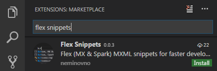
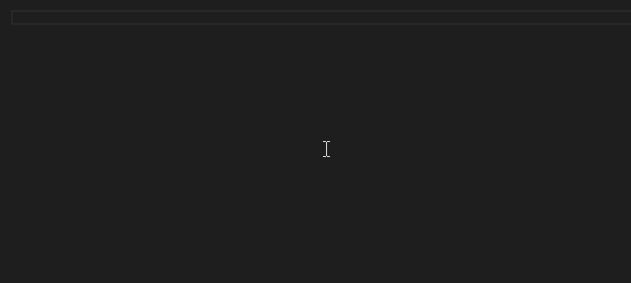

# Flex snippets for VSCode

Quickly create MX and Spark components.

## How to use

Install extension in VSCode 

Open mxml file, start typing component name and select snippet

> _Notice: To create Flex projects in VSCode install [ActionScript & MXML extension for Visual Studio Code](https://as3mxml.com)._

## Snippets

`AdvancedDataGrid`

`BorderContainer`

`Box`

`MX Button`

`Spark Button`

`Canvas`

`MX Checkbox`

`Spark Checkbox`

`MX ComboBox`

`Spark ComboBox `

`MX DataGrid`

`Spark DataGrid`

`DataGroup`

`DateFormatter`

`DateValidator`

`DropDownList`

`Ellipse`

`MX Form`

`Spark Form`

`Group`

`HBox`

`HGroup`

`HorizontalLayout`

`HTTPService`

`IconItemRenderer`

`MX Image`

`Spark Image`

`Spark Image with embedded source`

`MX Label`

`Spark Label`

`layout with HorizontalLayout`

`layout with VerticalLayout`

`Library`

`Line`

`Spark List`

`MX List with inline dataProvider`

`Spark List with inline dataProvider`

`MultiDPIBitmapSource`

`NumberFormatter`

`NumberValidator`

`Spark Panel with HorizontalLayout`

`Spark Panel with VerticalLayout`

`PhoneFormatter`

`PhoneNumberValidator`

`Rect`

`MX RemoteObject`

`Spark RemoteObject`

`MX Script`

`Spark Script`

`StringValidator`

`VBox`

`VerticalLayout `

`VGroup`

`WebService`

`ZipCodeFormatter`

`ZipCodeValidator`

`LinkButton`

`BitmapImage`

`ViewStack`

`MX TabBar`

`Spark TabBar`

`Spark TabBar with tabs`

`TabNavigator`

`HSlider`

`VSlider`
